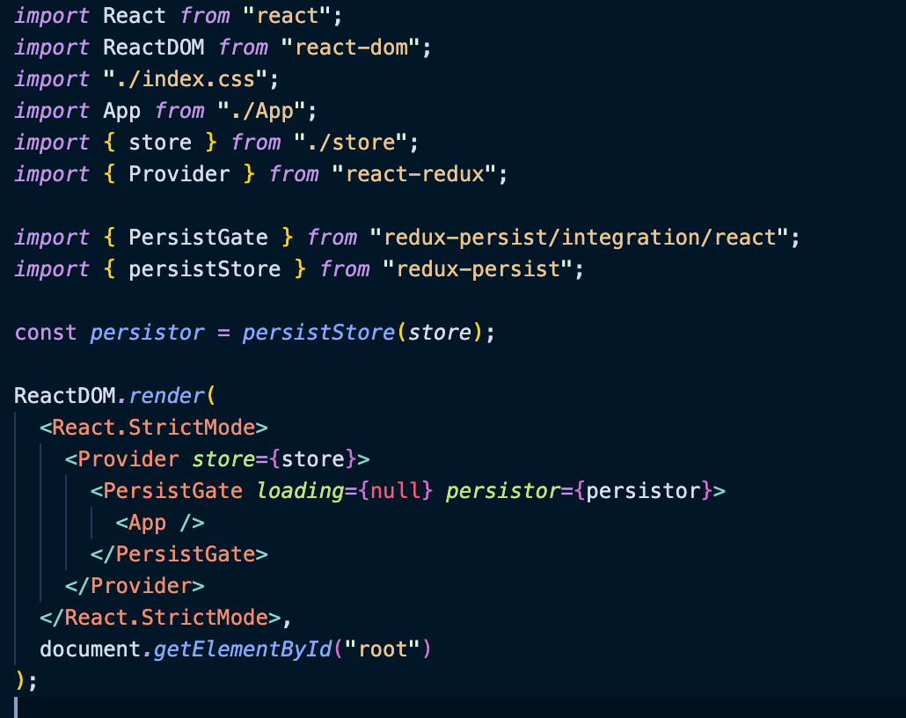

## PersistGate' cannot be used as a JSX component. Its instance type 'PersistGate' is not a valid JSX element. The types returned by 'render()' are incompatible between these types. 에러 해결

혼자 하고있는 프로젝트 중 css 로 이용하던게 있었는데 영 불편해서 tailwind 를 설치했다.
그동안 개인 프로젝트 및 회사에서도 쓰고있는 테일윈드라서 아무런 의심없이 설치했지만
뜬금없이 redux-persist의 PersistGate 에서 타입에러가 났다.

에러화면을 캡쳐하진 못했지만 에러의내용은 제목과 같다.

<h3>PersistGate' cannot be used as a JSX component. Its instance type 'PersistGate' is not a valid JSX element. The types returned by 'render()' are incompatible between these types.</h3>

stackoverflow 에 나와 비슷한 에러를 가진 사람이 올린게 있어 링크 걸어둔다.

Link 👉🏼 https://stackoverflow.com/questions/71826046/react-native-persistgate-cannot-be-used-as-a-jsx-component-its-instance-type

하지만 에러만 같을 뿐, 채택된 답변과 이미 같은  
"@types/react": "17.0.2",
"@types/react-dom": "17.0.2"
버전을 쓰고 있었기에 삽질을 꽤나 오래 했다.
일부러 에러 많이날까봐 리액트18버전으로 업그레이드 안한건데ㅠㅠ

### 결국은 타입에러

<b>위와같은 에러를 내는 이유를 크게 세가지로 나누면</b>

1. 단일 요소 대신 JSX 요소의 배열을 반환할 때.<br/>
2. JSX 요소 또는 구성 요소 이외의 값 (null) 반환할 때.<br/>
3. React 타입스크립트와 버전이 맞지 않을때. (무조건적으로 구 버전일때는 아닌것 같다.)<br/>

나는 사진과 같이

최상단의 index.tsx 에서 ReactDOM.render 안에서 감싸주고 있으므로 1,2번은 아닐거라고 판단했다.
( 사실 Provider 와 PersistGate를 App.tsx 로 옮긴 후 <>자식노드</> 로 감싸봤지만 여전히 에러는 발생했다 )

```js
npm install --save-dev @types/react@latest @types/react-dom@latest
or
yarn add @types/react@latest @types/react-dom@latest --dev
```

둘 중 사용하고 있는 것으로 골라 설치해주면 말끔하게 해결된다!
(결국엔 @types/react 18버전 ,, ,, ㅎ)

```js
"dependencies": {
    "@types/react": "^18.0.9",
    "@types/react-dom": "^18.0.5",
},
```
