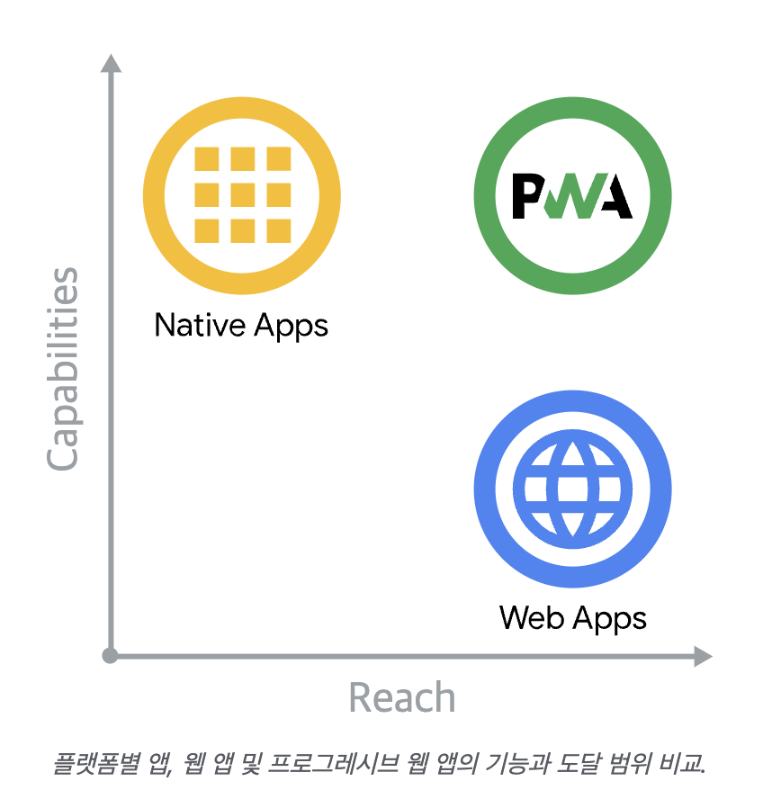
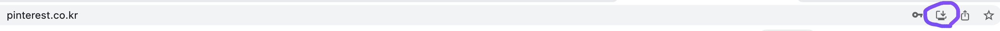

<h1> PWA란 ? </h1>

Google I/O 2016에서 처음 소개된 PWA는 Progressive Web Apps 의 약자로,
PWA는 웹과 네이티브 앱의 기능 모두의 이점을 갖도록 수 많은 특정 기술과 표준 패턴을 사용해 개발된 웹 앱이다.

<b>세가지 개념 : 기능, 안정성 및 설치 용이성 보장 </b>

일부 기능은 아직 웹에서 접근할 수 없지만 새로운 API와 향후 출시될 API에 힘 입어 파일 시스템 액세스, 미디어 제어, 앱 배지 및 완전한 클립보드 지원과 같은 기능을 웹에서도 이용할 수 있게 될 수도 있다.
최신 API, 웹 어셈블리, 새로운 API와 향후 출시될 API를 배경으로 웹 애플리케이션은 그 어느 때보다 많은 기능을 제공하며 이러한 기능은 계속해서 증가하고 있다.



프로그레시브 웹 앱(PWA)은 최신 API로 구축 및 강화되어 뛰어난 기능, 신뢰성 및 설치 용이성을 제공하는 동시에 단일 코드베이스로 누구에게나 어디서나 모든 장치에서 도달할 수 있다.

## 장점

<b>어플 같은 사용성</b>
PWA의 가장 강력한 장점은 스토어애 신청, 통과여부에 상관없이 사용자든 개발자든 쉽게 홈스크린에 아이콘을 설치하므로서 앱처럼 사용이 가능하다.
<b>Push 메시지 기능</b>
App의 중요 특징 중 하나인 Push가 가능하다. 원래 웹은 클라이언트에서 서버로 요청이 있어야만 결과물을 보내주는 형태로 구현이 되는데 Push는 반대로 클라이언트의 요청이 없더라도 서버의 필요에 의해서 클라이언트에게 데이터를 보낼 수 있는 기능이다. 보통 쪽지나 Notice형태로 제공된다.
<b>Offline 접속 기능</b>
데이터가 캐싱이 되기 때문에 Offline이거나 속도가 느린 상태에서도 미리 다운로드 되어 있는 정보를 계속 볼 수 있다.
<b>보안</b>
HTTPS 에서만 사용이 가능하기 때문에 일반 인터넷 데이터에 비해 보안이 강화된 상태라고 할 수 있다.

## 단점

완연한 app 이 아니기때문에 알람기능같은 몇가지 기능들이 동작하지 않을 수 있으며,
제일 중요한것은 아직 <b>ios 모바일 크롬</b> 환경에서는 지원하지 않는다는 것이다.
안드로이드, 웹에서는 크롬, 사파리, 파이어폭스 등 지원 가능하다. (웹에서는 윈도우 / 맥 다 가능!)

## 어떻게 사용할까?

### build without tool

<b>service-worker.js</b>

Service Workers는 PWA의 핵심으로, 서비스워커 설정을 통해 캐싱은 어떻게 할 것인지 요청시 캐시를 먼저 보여줄지 웹서버를 통해서 먼저 보여줄지, push 등등에 대한 프로그래밍하는 기술로써, 더 풀어서 말하자면
먼저 캐싱해둔 데이터 (or 미리 다운로드) 덕분에 오프라인 상태에서도 백그라운드 데이터를 보여줄 수 있는 상태가 될 수 있는 것이다.
PWA의 거의 80%에 해당하는 기술이라고 보면 된다.

```js
const CACHE_NAME = "offline";
const OFFLINE_URL = "offline.html";

self.addEventListener("install", function (event) {
	console.log("[ServiceWorker] Install");

	event.waitUntil(
		(async () => {
			const cache = await caches.open(CACHE_NAME);
			// Setting {cache: 'reload'} in the new request will ensure that the response
			// isn't fulfilled from the HTTP cache; i.e., it will be from the network.
			await cache.add(new Request(OFFLINE_URL, { cache: "reload" }));
		})(),
	);

	self.skipWaiting();
});

self.addEventListener("activate", (event) => {
	console.log("[ServiceWorker] Activate");
	event.waitUntil(
		(async () => {
			// Enable navigation preload if it's supported.
			// See https://developers.google.com/web/updates/2017/02/navigation-preload
			if ("navigationPreload" in self.registration) {
				await self.registration.navigationPreload.enable();
			}
		})(),
	);

	// Tell the active service worker to take control of the page immediately.
	self.clients.claim();
});

self.addEventListener("fetch", function (event) {
	// console.log('[Service Worker] Fetch', event.request.url);
	if (event.request.mode === "navigate") {
		event.respondWith(
			(async () => {
				try {
					const preloadResponse = await event.preloadResponse;
					if (preloadResponse) {
						return preloadResponse;
					}

					const networkResponse = await fetch(event.request);
					return networkResponse;
				} catch (error) {
					console.log(
						"[Service Worker] Fetch failed; returning offline page instead.",
						error,
					);

					const cache = await caches.open(CACHE_NAME);
					const cachedResponse = await cache.match(OFFLINE_URL);
					return cachedResponse;
				}
			})(),
		);
	}
});
```

<b>manifest.json</b>

manifest.json은 설치할 때 아이콘은 무얼 사용하고 아이콘을 눌렀을때 접속할 페이지는 무엇인지, 배경색은 무슨색으로 할 것인지 등등..에 대한 설정파일이라고 볼 수 있다.

```
//example

{
  "short_name": "Weather",
  "name": "Weather - Do I need an umbrella?",
  "description": "Weather forecast information",
  "icons": [
    {
      "src": "https://via.placeholder.com/48",
      "sizes": "48x48",
      "type": "image/png"
    },
  ],
  "start_url": "/",
  "background_color": "#3367D6",
  "display": "standalone",
  "scope": "/",
  "theme_color": "#3367D6"
}

```

<b>app icon editor</b>

Link to 👉🏼 https://maskable.app/editor

해당 링크에서 앱의 메인 아이콘으로 사용할 이미지를 편집 후 manifest.json 에 업데이트 한다.

```js
{
  …
  "icons": [
    …
    {
      "src": "path/to/regular_icon.png",
      "sizes": "196x196",
      "type": "image/png",
      "purpose": "any"
    },
    {
      "src": "path/to/maskable_icon.png",
      "sizes": "196x196",
      "type": "image/png",
      "purpose": "maskable" // <-- New property value `"maskable"`
    },
    …
  ],
  …
}
```

### build with pwabuilder

Link to 👉🏼 https://www.pwabuilder.com/ <br/>
service worker 와 manifest.json 코드, icon을 직접 설정하기 어렵다면 pwabuilder 사이트를 적극 활용해도 좋다.
pwa builder 사이트는 내 사이트가 pwa 로 적합한지, 아니라면 어떤 서비스 워커 및 manifest.json 자바스크립트 명령어가 들어가야 하는지 쉽게 적용할 수 있다.
또한 원하는 이미지를 업로드 하기만 하면 아이콘 형태의 이미지 파일들이 생성되며, 만들어진 코드와 파일을 프로젝트에 복붙하기만 하면 된다.<br/>

### building in React / Next.js environment.

순수 자바스크립트가 아닌 리액트나 넥스트에서 사용할 경우 npm / yarn 패키지로 설치 가능하다.

```js
//react : https://www.npmjs.com/package/react-pwa-install
npm i react-pwa-install

// next.js :  https://www.npmjs.com/package/next-pwa
npm i next-pwa

```

### pwa 홈화면 추가하기

ios 모바일 기기를 제외한 곳에서 설치가 가능한데,

위와같이 크롬 및 사파리 사이트에서 다운로드 아이콘을 발견한다면 해당 사이트는 pwa로 설치가 가능한 웹사이트이다.
클릭 한번으로 유저는 쉽게 앱처럼 사용할 수 있다.

출처 https://web.dev/progressive-web-apps/#codelabs
