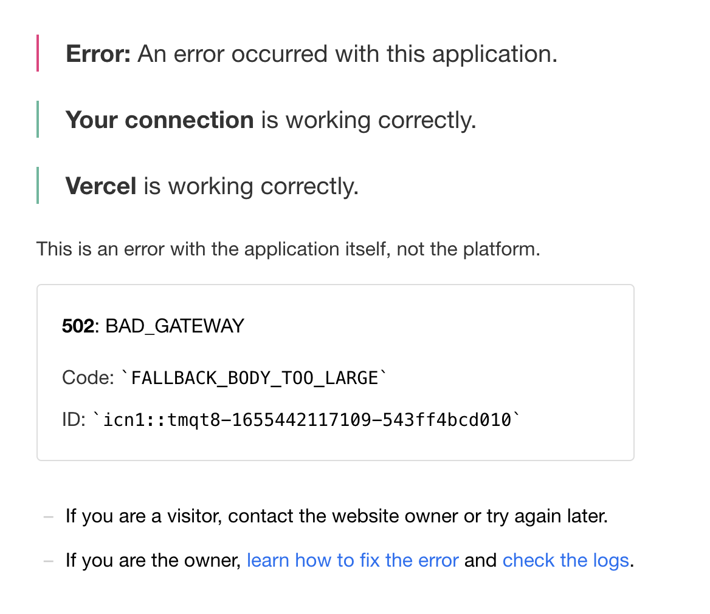
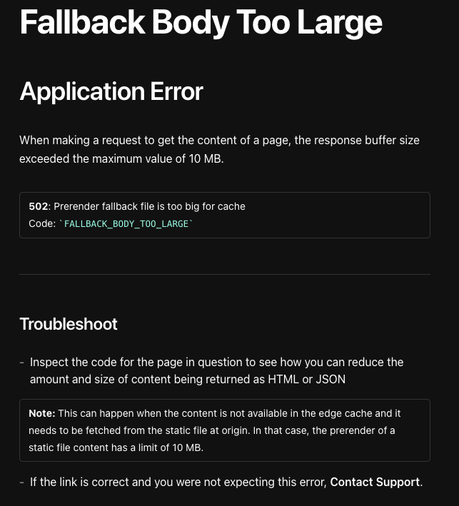
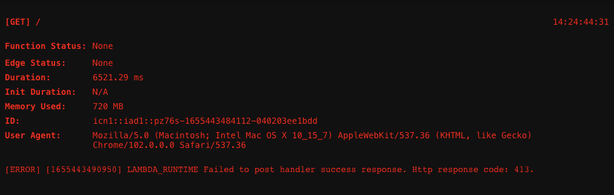

## Before I start ..

빌드에러 하나 없이 무사히 배포를 했다고 생각했는데 실배포에서 해당이슈가 발생해버렸다. 

똥줄타는 마음으로 에러링크를 타고 들어갔더니
 

 

공식문서에 나와있는게 전부이고 다른 리뷰들은 찾아볼수가 없었다. ㅠㅠ 나만 이런에러가 난건가? 하고 계속 삽질 한 결과,
한 페이지를 가져올때 maximum value는 10MB라고 한다.
아래의 사진을 보면 메모리 사용량이 720MB인 것을 보면 굉장히 많은 메모리를 사용하고 있는 것으로 보여진다.

### 알고보니

하필 이때 테크리더님은 병가여서 오로지 혼자 해결했어야 했는데 급한대로 Vercel 에서 Amplify 로 옮겨두었다.
이상하게 옮기니까 되는 매직~
일단 실서버에서 잘돌아가는 것을 확인했으니 본격 에러를 잡아보자.

멀쩡하게 잘 돌아가던 프로젝트가 왜 갑자기 빌드에러를 내었을까
실배포 main 브랜치와 어떤코드 변경이 있었는지 하나씩 로그를 찾아보던 결과,
프로덕션 서버에서만 에러로그를 확인할 수 있는 sentry 를 install 할때 환경변수를 건드린게 문제였다.
프로덕션 서버일때 콘솔을 뱉게 한다. 이런식으로 코드를 작성했는데
node.env === 'production' ? ~~
가 아닌
node.env === 'main'
이렇게 작성했어야 했다.

그렇게 20분간의 실서버 중단이 이뤄졌고 대표님에게 끌려갔다는 이야기 ,, 총총

환경변수는 왠만하면 건드리지말자 .. ,, !
