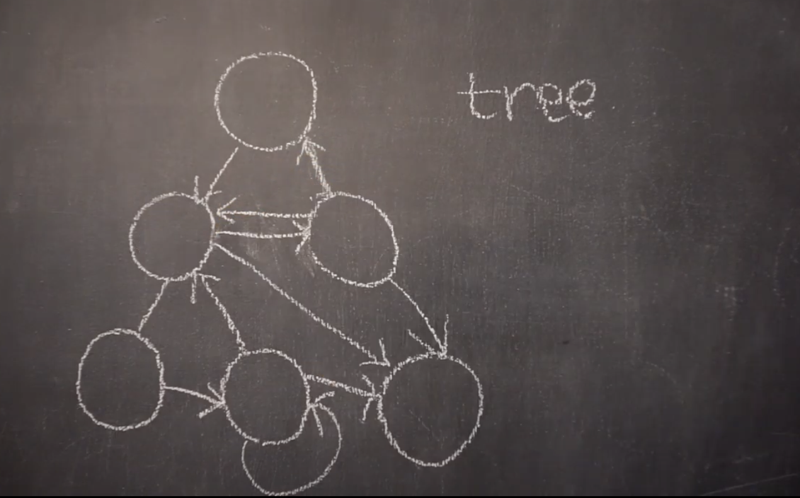
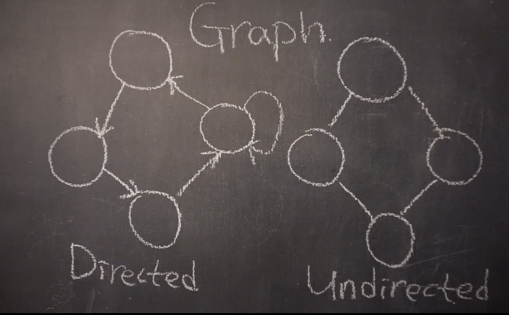
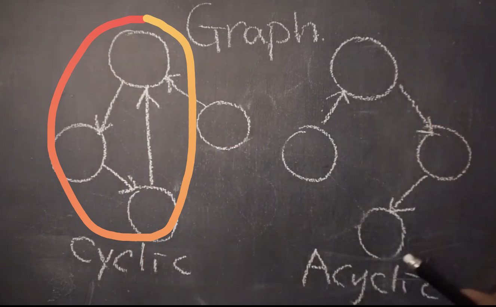
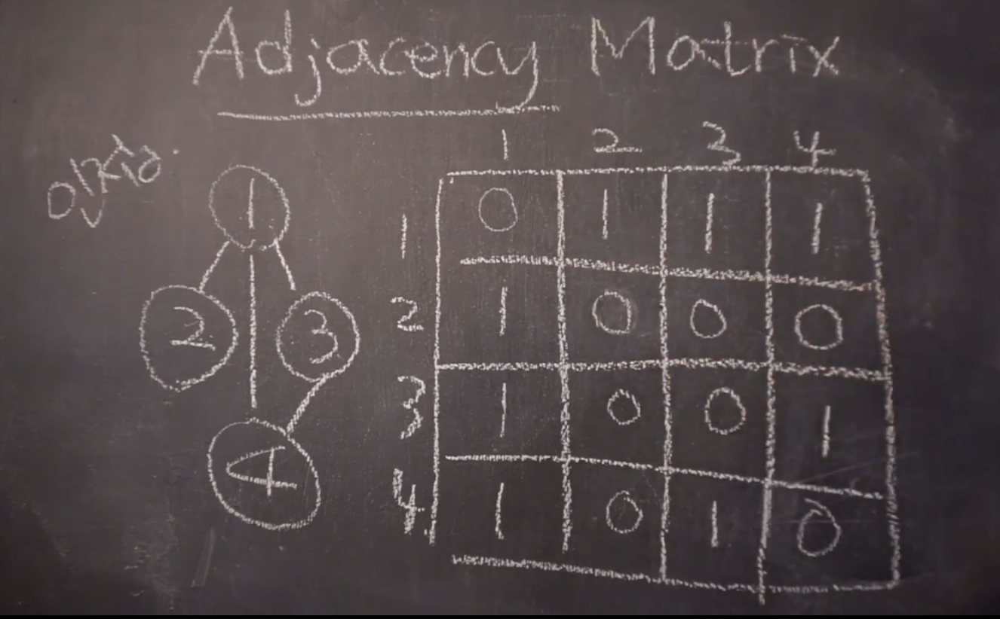
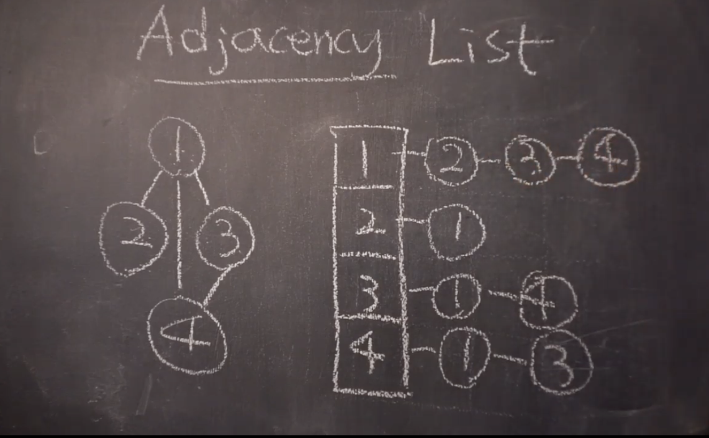
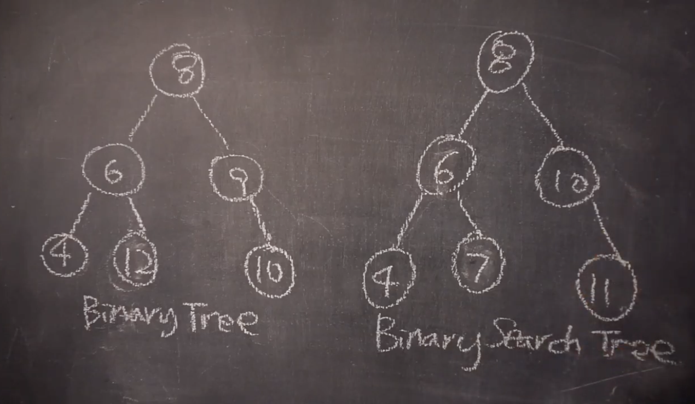
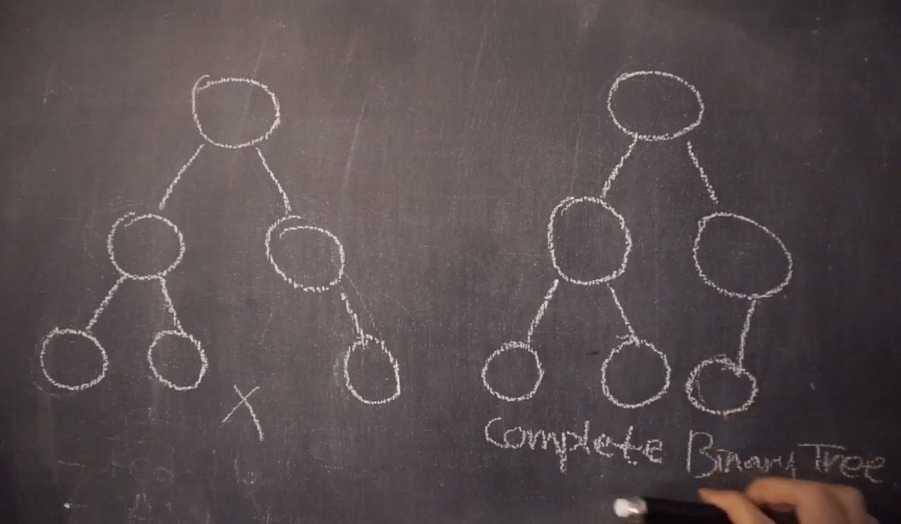
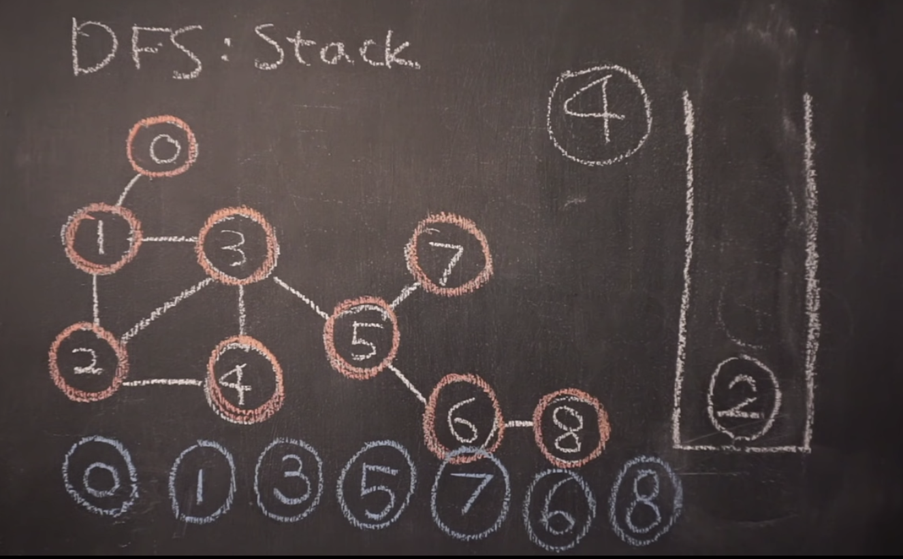
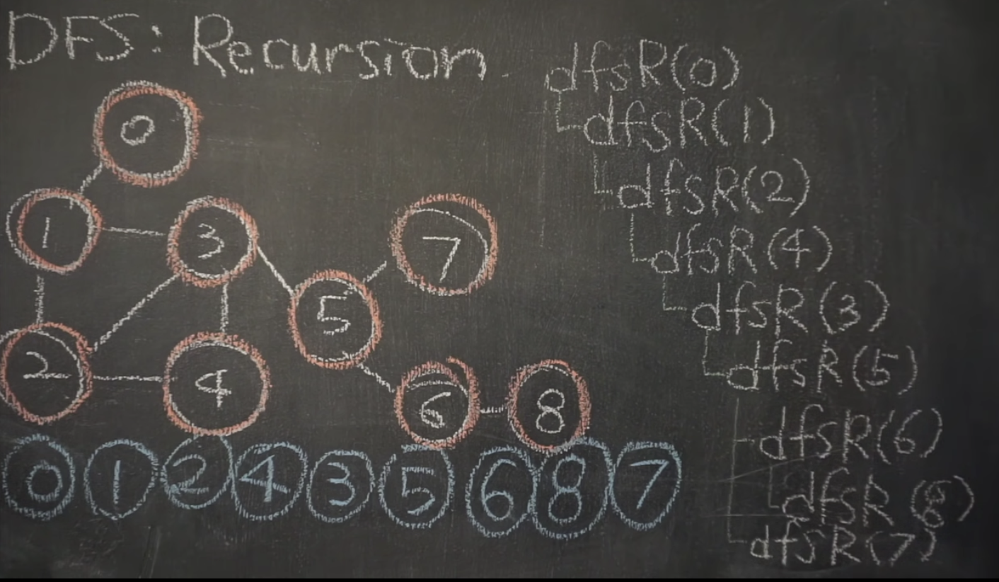

# 그래프와 트리

## 📈 그래프

노드와 그 노드를 연결하는 간선(edge)를 하나로 모아놓은 **자료구조**

즉, 연결되어있는 객체 간의 관계를 표현할 수 있는 구조를 말한다.

✅ **방향그래프**와 무방향 그래프 모두 존재한다.

✅ 순환그래프(사이클), **비순환 그래프** 모두 존재한다.

✅ 루트 노드의 개념이 없다.

✅ 부모-자식 간의 개념이 없다.

✅ 네트워크 모델

✅ **DFS, BFS 방식**으로 순회한다.

✅ 그래프에 따라 간선의 수가 다르고 간선이 없을 수 도 있다.

ex ) 지도, 지하철 노선도의 **최단경로**, 전기회로의 소자들, 도로의 교차점과 일방통행길
 
 

트리와는 다르게,

그래프는 위아래로 조종할수도있고 방향을 아예안가질수도있고 들어오는곳이 여러군데가 될수도있고 옆에있는 노드랑 주고받을수도있고 엣지가 돌아서 자기자신을 가르키기도하고 돌고 돌아서 서클이 생기기도하고 루트도 없어지고 아주 복잡한게 그래프이다.

트리는 그래프의 한 형태일뿐이다. (아래로 사이클이 흐르는 방향그래프)

여기서 트리는 Directed 그래프가 된다.

방향그래프는 셀프엣지라고 자기 자신을 가르키는것도 있다.

사진처럼, 그래프 내부에서 원을 만든것을 하나이상의 원이 만들어진것을 사이클 그래프라고 하고 왼쪽처럼 원이 그려지지 않는 형태를 에이사이클릭 그래프라한다

그래프를 표현하는 방법

인접 매트릭스 - 이치원배열에 표현방법, 그래프를 표에다가 표현하는 방법

서로 연결된 노드들은 1, 연결이 없으면 0 으로 2차원배열들을 채우는것.

인접 리스트 - 배열에 노드를 나열하고 관계를 링크드 리스트로 표현하는 방법

배열방에 모든노드 집어넣고 쭉 순서상관없이 나열해서 저장하는 방법

각 노드들의 갯수는 몇개일까?

각 노드들은 관계를 나타낸다. 엣지의 갯수를 m이라 할 때 총 노드의 갯수는 2m개가 된다.

연결은 서로연결되는것이기 때문에 ex) 3↔4 원래 엣지갯수보다 노드가 2배 많아지게 된다.
 
 

---

## 🎄트리

**그래프의 한 종류**, 방향성이 있는 비순환 그래프의 한 종류

✅ 방향그래프

✅ 한개의 루트 노드만이 존재하며 모든 자식 노드는 한개의 부모 노드만을 가진다.

✅ 부모-자식관계가 top-bottom 또는 bottom-top 으로 이루어진다.

✅ 계층 모델

✅ DFS, BFS **안의 Pre, In-, Post-order** 로 순회한다.

✅ 노드가 N인 트리는 항상 N-1 의 간선을 가진다.

ex ) 이진 트리, 이진 탐색 트리, 균형트리, 이진 힙(최대,최소 힙)
 
 

Array, LinkedList , Stack, Queue 와 같이 일직선으로 된 데이터구조.

루트가 있고, 아래로 차일드노드들이 있고, 노드를 연결하는 선 엣지가 있고 엣지의 방향은 위에서 아래로, 들어오는곳은 하나고 나가는 곳은 여러개가 될수있다.

트리는 부모자식관계를 가지는 구조, 계층, 구조 그룹임. 노드가 하나이상의 자식을 가질때 트리라고 한다. 노드중에는 부모를 아는경우도있고 자식만아는경우도 있고 데이터가 섞여있는 경우도있다.

맨끝에 더이상 자식이 없는 노드를 leaf 라고 한다.
 
 

**Binary tree (이진트리)**

다른조건없이 노드에 차일드가 최대 두개씩만 붙어있으면 그게 이진트리

노드가 세개차일드 붙으면 ternary tree ..

**Binary search tree (이진검색트리)**

노드에 차일그안에 데이터가 왼쪽노드와 그 이하 차일드 노드가 현재 노드보다 작아야하고 오른쪽 노드들은 현재노드보다 커야한다.

사진을 예시로 보면, 8이라는 현재 노드값보다 더 큰 12가 왼쪽에 있다. 더 큼에도 오른쪽에서 찾을 수 없으니 이런경우에는 이진트리검색이 되고,

만약 오른쪽트리에서 찾을 수 있으면 이진 검색트리가 된다.

**Complete Binary Tree (완전이진트리)**

모든 노드들이 층별로 왼쪽부터 채워져있으면 완전이진트리다.

마지막 레벨을 제외한 모든 서브트리의 레벨이 같아야하고 마지막레벨은 왼쪽부터 채워져있으면 완전이진트리이다.

왼쪽트리의 경우 오른쪽이 채워져있으므로 완전이진트리로 볼 수 없다.

**Full Binary Tree**

그안의 노드들이 차일드를 안가지려면 한명도 갖지말고 가지려면 둘을 가져라

**Perfect Binary Tree (포화이진트리)**

양쪽으로 빈공간없이 자식들, 레벨도 같은 완벽한 피라미드형태를 가진트리를 말한다.
 
 

---

## **깊이우선탐색 - DFS**

DFS - Depth First Search

바이너리트리를 순회할때 사용했던 in order, pre order, post order 순회방법이 DFS에 속한다.

하나의차일드 노드를 방문했으면 해당차일드 노드의 차일드, 그 차일드 노드의 차일드 노드들을 끝까지 파고드는것이다. 그다음 나와서 다음줄기를가고 또 나와서 다음줄기… 마지막노드를 만날때까지 갔다가 다시 올라와서 다시 옆의 형제노드들을 방문

### 어떻게 구현할까?

Stack 을 이용해 구현

**개념**

처음 빈 스택에 루트를 넣고 시작

노드를 하나 꺼내서 해당 차일드 노드를 전부 스택에 넣고 꺼낸 노드는 출력.

차일드노드를 스택에 넣을때 한번 스택에 담았던 노드는 다시 넣지 않는다.

스택이 다 비게되면 순회가 완료된것이다.

### 재귀를 사용하면 훨씬 간단해진다.

노드에 방문하면 데이터를 출력하고, 자식들을 순서대로 재귀호출해주는것

자식들이 호출을 받으면 자기를 출력하고, 자기 자식들을 재귀호출 해준다.

반환하기전에 자식들을 먼저 호출하기 때문에 재귀호출로 깊이우선탐색이 가능한것.

시작노드 0으로 호출, 자식을 부르기전에 자기 자신을 출력해주기 때문

만약 재귀호출을 다녀와서 출력을 하게되면 자식들이 먼저 출력되서 leaf 부터 올라오는게 되므로 이상해져 버린다.

그렇기 때문에 호출되면 일단 출력부터 한다.
 
 

---

## **너비우선탐색 - BFS**

BFS - Breadth First Search

시작점에서 자신의 차일드노드를 먼저 다 방문하고 그 다음 자식의 자식방문.. **레벨단위**로 검색하는것

Queue를 이용해 구현

큐를 하나만들고 처음에는 큐에 노드가 없으니까 시작할 노드 루트를 일단 넣고 (여기까진 스택과동일)

한번 큐에 넣었던 노드는 다시 넣지 않는다.

큐는 위에서넣고 **아래에서 빼는 개념**임을 잊지 않는다.

밑에서 하나 꺼내고 그 노드의 자식들을 큐에 추가, 꺼낸 노드는 출력

큐에서 하나 꺼내고 자식노드들을 하나씩 추가, 꺼낸노드는 출력
